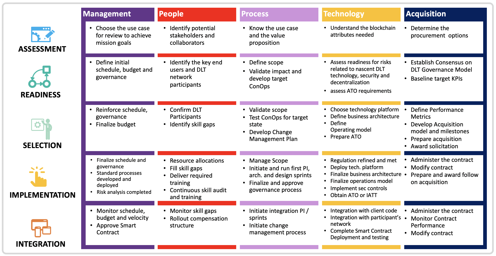

# Introduction

As noted in the Blockchain [Primer](https://www.actiac.org/act-iac-white-paper-enabling-blockchain-innovation-us-federal-government), blockchain may be applied to help government to reduce fraud, errors, and the cost of paper-intensive processes, while enabling collaboration across multiple divisions and agencies to provide more efficient and effective services to citizens. The adoption of blockchain may enable government agencies to provide new value-added services and modernize IT. How can agencies turn that potential into reality?

- **Understand the technology using the Blockchain Primer:** Over one dozen federal agencies and a variety of industry partners collaborated to develop the ACT-IAC Blockchain Primer which provides the government workforce with an introduction to blockchain and its related technologies, as well as its many potential use cases. 

- **Incorporate blockchain functionality using the Blockchain Playbook:** The ACT-IAC Blockchain Working Group developed this playbook to guide the government workforce in taking the appropriate steps and developing the necessary plans to implement the right technology to achieve the goals of their mission. 

- **Blockchain and decentralized organizations:** Blockchain has the potential to significantly impact both business processes as well as the fabric of the organization. The usual linear value chain, where value is added in strict sequential order, is being replaced by networked value chain where entities and the entire environment are networked together with automated code (e.g. smart contracts). In a networked value chain enabled by blockchain, there is a more efficient use of resources and process execution, which leads to cost savings and reductions in cycle times. In terms of the organizational structure, classical hierarchical layers may be replaced by a new model emerging from implementations of blockchain and other digital transformation technologies – decentralized organization. These decentralized organization leverages intelligent and distributed nodes that are empowered to execute various processes without human intervention or central oversight.

This playbook applies the concepts of the General Services Administration’s Modernization and Migration Management (M3) unified shared services framework to help the government achieve successful outcomes and reduce risk during a blockchain deployment. It involves the modernization of information systems, as well as the migration of data and/or other capabilities. The progression of this framework ensures the government will be able to optimize its resources to deliver the most effective solution.

Users may leverage this playbook during each iteration of a blockchain solution’s implementation: minimally viable product, proof of concept, pilot/limited fielding, initial operational capability, full operational capability, etc. Not all topics in each phase may apply to all iterations. However, this playbook should remain useful as a solution moves through its lifecycle.  

It is also important to note that at scale and fully implemented, a distributed ledger technology will probably not be a party of one or even two – more like a party of 5, 25, 100, 1000.  A blockchain solution is not like any other organizational technology solution because among other things no one organization alone will be in control of the final product (if it’s implemented as intended).  Therefore, it is important that at the onset, any organization interested in leveraging blockchain will need to define the appropriate stakeholders and the group (network peers) that will participate in the steps outlined in the playbook.

To address the current high level of government interest and desire to begin deploying blockchain solutions, launch of this playbook occurs in two stages. The next stage will begin on April 2018 to continue supporting these efforts as they evolve.

As government efforts move through implementation of this new and rapidly developing technology, contributions to this playbook (e.g. additional best practices, lessons learned, and other information) are appreciated to ensure this resource is current, comprehensive, and effective in meeting the needs of government.

_Figure 1: blockchain playbook phases - [expand](../assets/img/playbook/pb-process.png){:target="_blank"}_

The first three phases of a five-phased approach, which includes key activities and outcomes for each phase, are addressed in this edition of the playbook. 

**Phase 1 Problem Assessment:** Develop a vision and business objectives through various assessments to ensure the blockchain solution addresses a specific use case and delivers results that optimize services and operational delivery.

**Phase 2 Organizational Readiness:** Engage blockchain subject matter experts and consider the nuances that accompany a blockchain solution to prepare the organization(s), including the standup of a project management office, as well as the establishment of blockchain-tailored business, functional, and technical requirements and implementation plans.

**Phase 3 Technology Selection:** Conduct a thorough investigation of the business considerations (e.g. consensus mechanism, transaction costs, and on chain/off-chain data requirements), types of blockchains, digital asset and distributed ledger technology (DLT) requirements and considerations, deployment models, and procurement options to enable optimal provider selection to achieve the desired end state.

**Phase 4 Blockchain Implementation:** Do the implementation, customization and configuration of the blockchain solution.

**Phase 5 blockchain Integration:** Integrate the blockchain solution into the organization(s)' infrastructure.

_Figure 2: blockchain playbook phases and key activities matrix - [expand](../assets/img/playbook/pb-key-activities.png){:target="_blank"}_

Also included at the end of this playbook is a glossary to assist with the in-depth terminology associated with advanced blockchain concepts and appendices to elaborate on each selection topic at a more granular level. 

[Next](/blockchain-playbook/phases/1/){: .usa-button .usa-button-big }